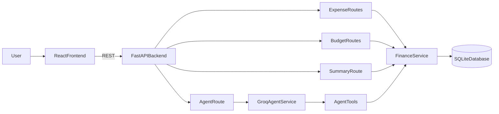

# AI Expense Tracker - Architecture Guide

This document captures the core architecture and essential technical details for the repository.

## 1) Purpose

AI Expense Tracker is a local-first full-stack MVP that combines:

- Traditional expense CRUD and budgeting
- Analytics (monthly summary + category breakdown)
- LLM-powered natural language interaction through tool calling

## 2) Tech Stack

- Backend: FastAPI (Python)
- ORM/DB: SQLAlchemy + SQLite
- Frontend: React + Vite + Tailwind CSS
- Charts: Recharts
- LLM: Groq Chat Completions API

## 3) High-Level Architecture



## 4) Repository Layout

```text
.
|-- backend/
|   |-- app/
|   |   |-- agent/        # Groq tool-calling service + tool adapters
|   |   |-- db/           # SQLAlchemy session/base config
|   |   |-- models/       # ORM models
|   |   |-- routes/       # FastAPI route handlers
|   |   |-- schemas/      # Pydantic request/response models
|   |   |-- services/     # Business logic
|   |   `-- main.py       # App bootstrapping, CORS, router wiring
|   |-- requirements.txt
|   `-- .env.example
|-- frontend/
|   |-- src/
|   |   |-- api/          # HTTP client methods for backend APIs
|   |   |-- components/   # UI modules (form/table/dashboard/chat)
|   |   |-- App.tsx
|   |   `-- main.tsx
|   `-- .env.example
|-- README.md
`-- ARCHITECTURE.md
```

## 5) Data Model

### Expense

- `id` (int, PK)
- `amount` (float, required)
- `category` (`Food` | `Fuel` | `Other`)
- `date` (date)
- `note` (optional string)
- `created_at` (timestamp)

### Budget

- `id` (int, PK)
- `month` (string, `YYYY-MM`, unique)
- `amount` (float)

## 6) API Contract

- `POST /expense`
  - Create one expense
- `GET /expenses`
  - List expenses
  - Query filters: `start_date`, `end_date`, `category`
- `POST /budget`
  - Set or update monthly budget
- `GET /summary`
  - Get monthly total, remaining budget, category breakdown
  - Query: `month=YYYY-MM` (defaults to current month)
- `POST /agent/chat`
  - Natural-language request to AI assistant
- `GET /health`
  - Service health check

## 7) Agent + Tool Calling Design

`GroqAgentService` defines function tools exposed to the model:

- `add_expense(amount, category, date_value, note)`
- `get_expenses(start_date, end_date, category)`
- `get_summary(month)`
- `set_budget(month, amount)`

Execution loop:

1. User message is sent to Groq with tool schemas
2. Model requests tool calls (if needed)
3. Backend executes mapped Python functions in `app/agent/tools.py`
4. Tool outputs are appended as `tool` messages
5. Model generates a final human-readable response

Notes:

- Missing optional arguments are normalized in backend (defensive defaults)
- If category is absent/unrecognized, service falls back safely to `Other`

## 8) Frontend Responsibilities

- Expense creation form
- Expense table with date/category filters
- Budget input for monthly limit
- Summary cards and pie chart visualization
- Chat panel for natural-language agent interaction

## 9) Configuration and Environment

### Backend (`backend/.env`)

- `GROQ_API_KEY` - required for chat endpoint
- `GROQ_MODEL` - e.g. `llama-3.3-70b-versatile`
- `DATABASE_URL` - default SQLite path
- `FRONTEND_ORIGIN` - allowed CORS origin

### Frontend (`frontend/.env`)

- `VITE_API_BASE_URL` - backend base URL (default `http://localhost:8000`)

## 10) Security and Repo Hygiene

- Secrets are not committed (`.env` and `*.env` ignored)
- Local DB artifacts excluded from git
- Build artifacts and dependency directories ignored

See `.gitignore` for full rules.

## 11) Operational Notes

- Backend startup creates DB tables automatically via SQLAlchemy metadata
- Recommended local run:
  - Backend: `uvicorn app.main:app --reload --port 8000`
  - Frontend: `npm run dev`

## 12) Future Improvements

- Add authentication and per-user data isolation
- Add migrations (Alembic) for schema versioning
- Add test suite (unit + API + agent integration tests)
- Add caching and retry/backoff for LLM calls
- Add richer analytics (monthly trends, forecast)
